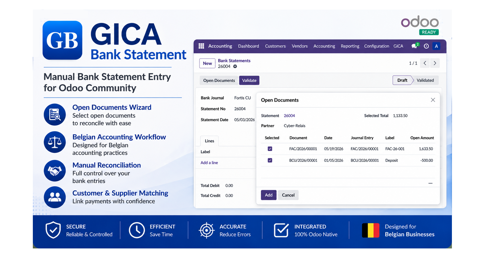

# GICA Apps Store

Open-source GICA modules for Odoo Community.

This repository hosts the official collection of GICA modules for Odoo, providing accounting, banking, Peppol, migration and business management tools designed to bridge traditional GICA workflows with the Odoo ecosystem.

---

## Available Modules

### GICA Bank Statement

Manual bank statement entry for Odoo Community.

Main features:

* Manual bank statement entry
* Open Documents Wizard
* Real-time amount calculation
* Customer and supplier reconciliation
* Standard Odoo journal entries
* Belgian accounting workflow
* Full compatibility with Odoo accounting and reconciliation mechanisms

The Open Documents Wizard allows accountants to select and combine multiple open customer or supplier documents while the running total is updated in real time. This makes it easy to reconstruct the exact amount appearing on a bank statement using a workflow familiar to many Belgian accounting professionals.

---

## Planned Modules

The repository is intended to host additional GICA modules, including:

* GICA Peppol
* GICA Import
* GICA Migration Tools
* GICA Matching
* Other accounting and business management extensions

---

## Target Versions

| Odoo Version      | Status    |
| ----------------- | --------- |
| Odoo 17 Community | Supported |
| Odoo 18 Community | Planned   |

---

## Languages

Current modules may include:

* English
* Françs
* Nederlands

---

## License

Each module contains its own license information.

Unless otherwise specified, modules are distributed under the LGPL-3 license.

---

## Website

https://www.eurologiciel.be

---

## Author

**Jean-Luc Walem**
Eurologiciel SA
Belgium

---

## About GICA

GICA is an ERP solution developed and maintained by Eurologiciel for many years. The goal of this repository is to progressively bring selected GICA workflows and business features to the Odoo Community ecosystem while preserving the flexibility and openness of Odoo.

