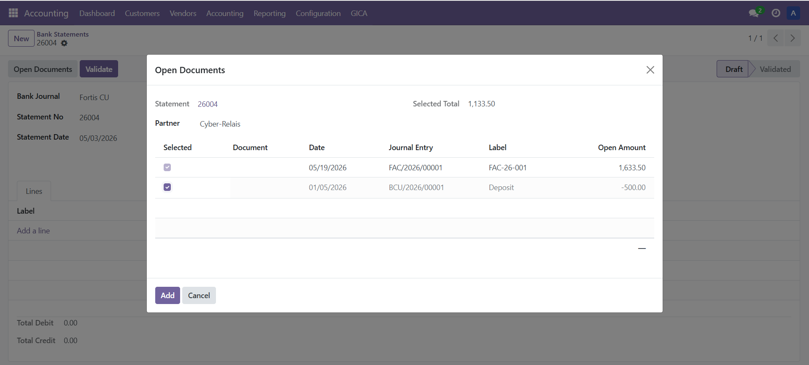
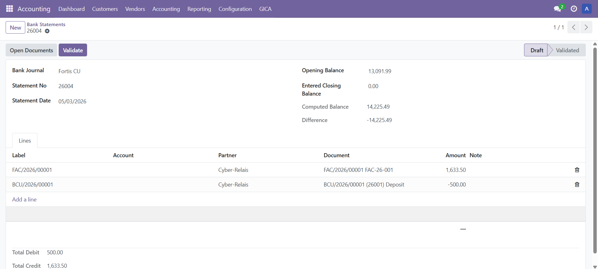
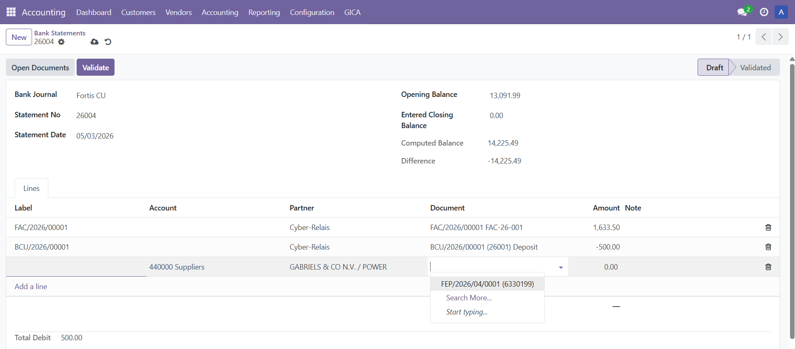
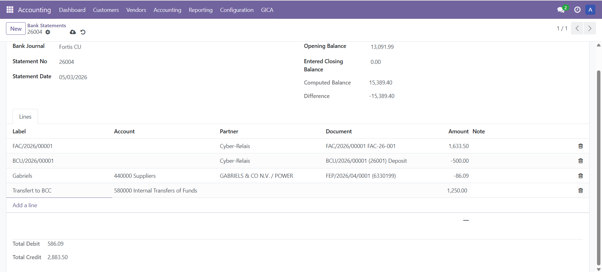
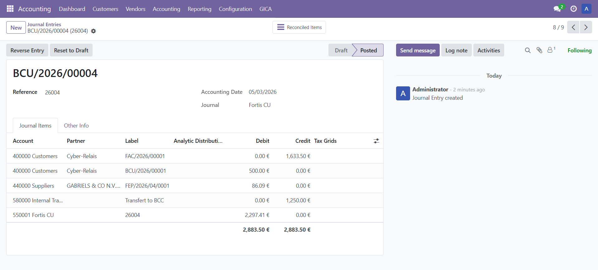
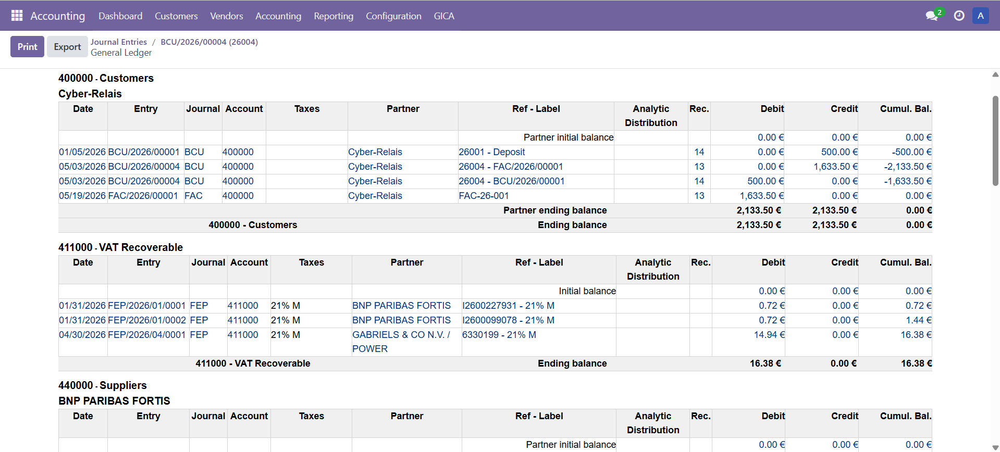
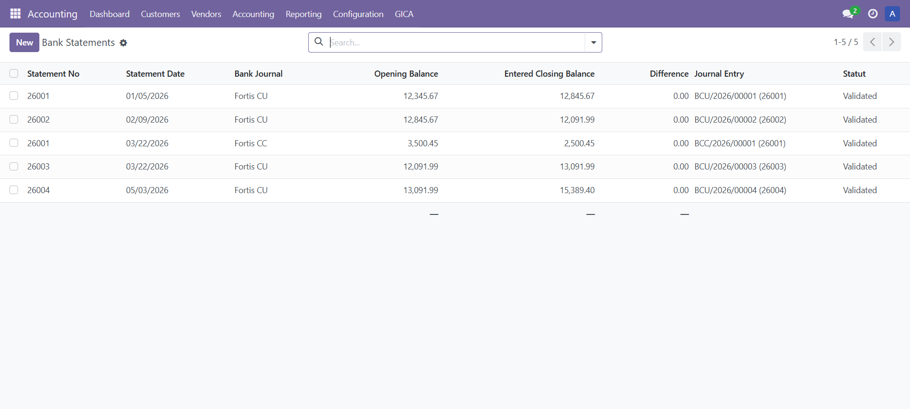
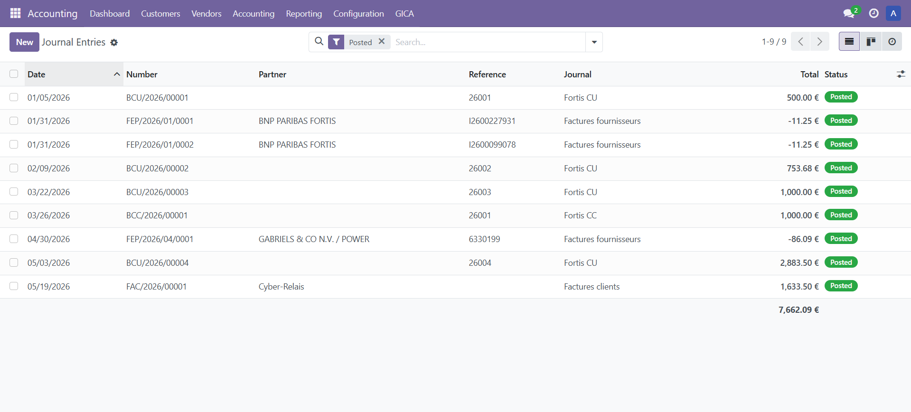

# GICA Bank Statement

Manual bank statement entry and document matching for Odoo.

Enter bank statements manually while matching invoices, credit notes and advance payments before posting standard Odoo accounting entries.

Designed for organisations that prefer manual bank statement processing while keeping full control over accounting reconciliation.

---

## Match open documents while rebuilding the bank statement amount

When entering a bank statement manually, identifying the documents corresponding to a payment can be time consuming.

With GICA Bank Statement you can:

* match multiple invoices on a single payment;
* combine invoices, credit notes and advance payments;
* rebuild the exact bank statement amount in real time;
* insert selected documents automatically;
* create manual accounting lines when required;
* post standard Odoo accounting entries;
* reconcile customer and supplier ledgers using the standard Odoo mechanism.

The document selection process makes manual bank statement entry both faster and more reliable.

---

## Open documents selection

Select several open customer or supplier documents, including invoices, credit notes and advance payments, before inserting them into the bank statement.

As documents are selected or deselected, the total amount is updated in real time. This allows the accountant to reconstruct exactly the amount appearing on the bank statement.

---

## Bank statement after insertion

The selected open documents are inserted into the bank statement while preserving complete accounting traceability.

---

## Single document selection

A single invoice, credit note or advance payment can also be selected directly from a statement line.

---

## Manual accounting lines

Additional statement lines may be entered using a general ledger account, for example a transfer account or another miscellaneous accounting operation.

---

## Posted bank statement

Once posted, the statement generates standard Odoo debit and credit accounting lines.

---

## Customer and supplier reconciliation

Customer and supplier ledgers are reconciled using the standard Odoo reconciliation mechanism.

**No parallel accounting.**

**No proprietary reconciliation process.**

---

## Bank statements

Manage multiple bank statements, including statements belonging to different bank journals.

---

## Journal entries

Generated accounting entries remain fully standard Odoo journal entries.

---

## Languages

Available in:

* English
* French
* Dutch

---

## Requirements

### Odoo Enterprise

Install the complete **Accounting** application.

### Odoo Community

The complete Accounting interface should be available.

If necessary, the OCA module **account_usability** (or an equivalent solution) can be installed to expose the complete Accounting menus.

### Dependencies

Only the standard Odoo module:

* **account**

is required.

---

## Why GICA Bank Statement?

* Manual bank statement entry
* Open document matching
* Real-time amount calculation
* Multiple document selection
* Invoices, credit notes and advance payments
* Manual accounting lines
* Standard Odoo journal entries
* Standard Odoo reconciliation
* Complete accounting traceability
