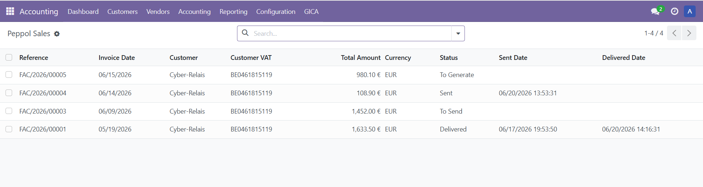
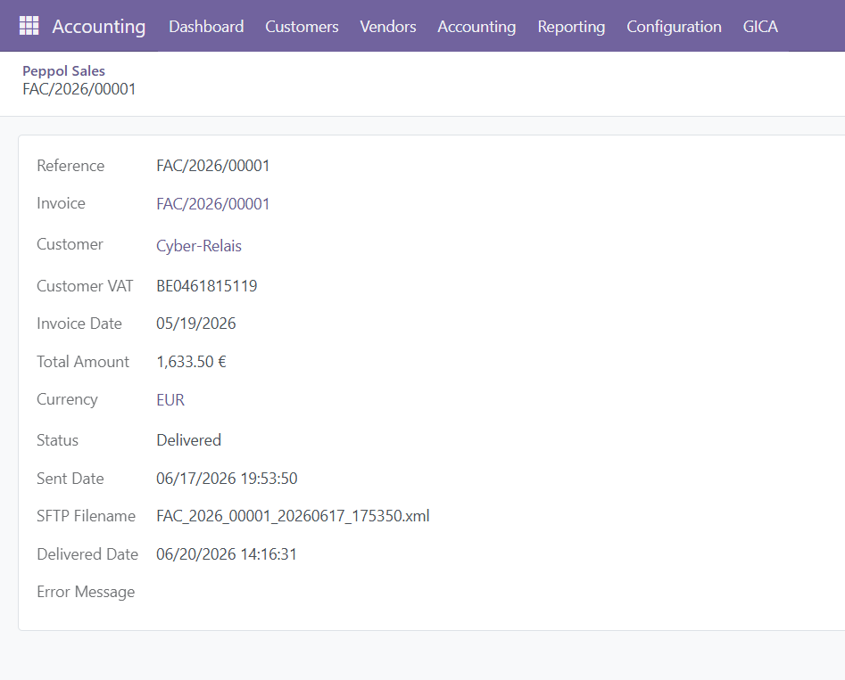
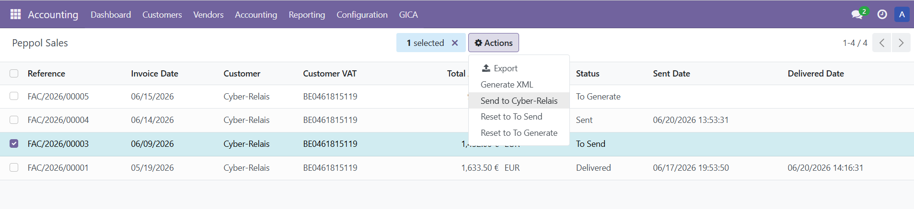
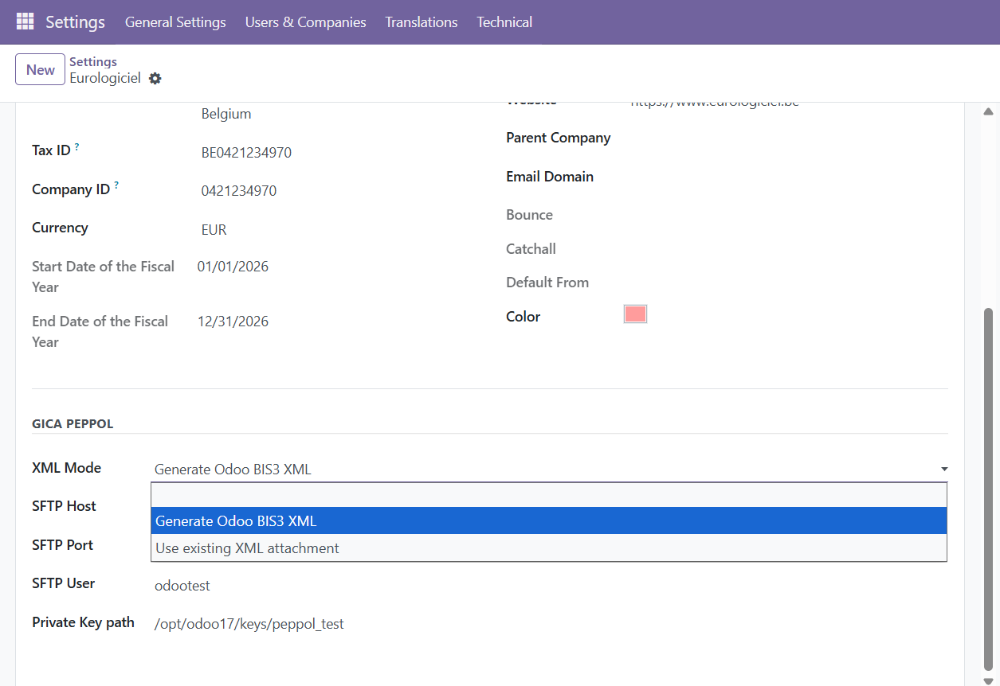
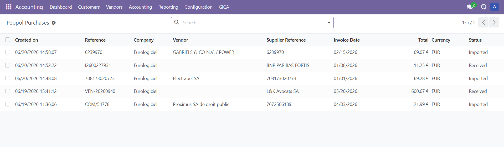
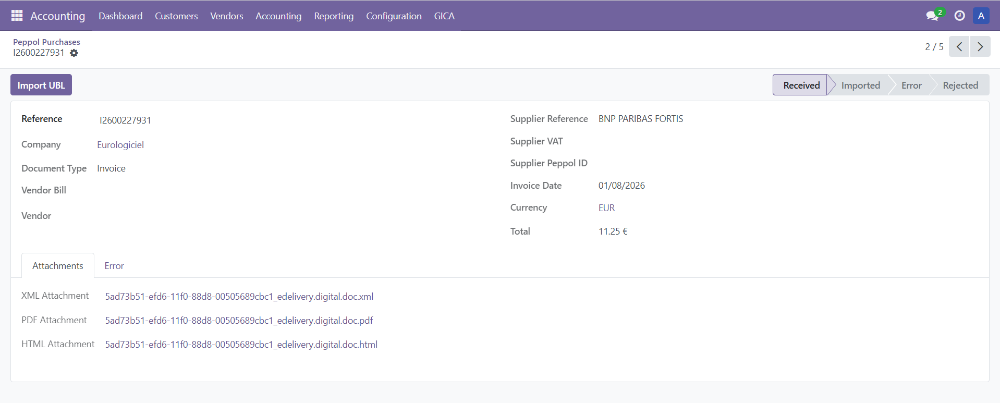
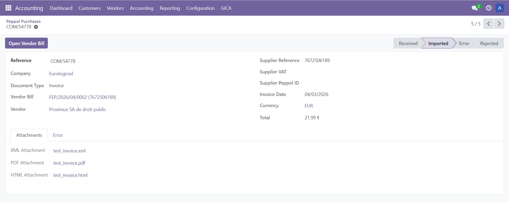
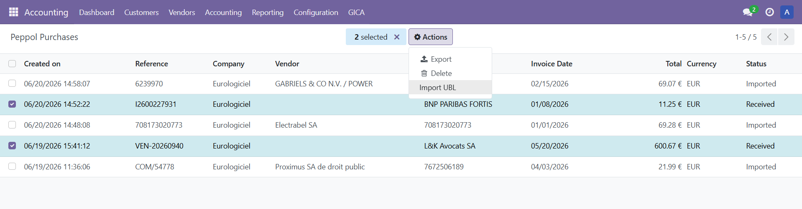

# GICA Peppol

Peppol document exchange for Odoo.

Send and receive electronic invoices through the Peppol network while keeping the complete process integrated with standard Odoo Accounting.

Designed for organisations that want to automate inbound and outbound invoice exchange while retaining full control over documents, processing status and accounting validation.

---

## Outbound Peppol sales

GICA Peppol creates outbound Peppol documents directly from posted customer invoices and prepares everything required for electronic delivery.

With GICA Peppol you can:

* create Peppol sales records from posted invoices;
* generate UBL BIS 3.0 XML documents;
* generate or reuse invoice PDF attachments;
* send documents through the configured connectivity service;
* monitor transmission status;
* support multi-company environments.

The complete outbound process remains fully integrated with standard Odoo Accounting.

### Outbound Peppol sales overview

Review outbound Peppol sales documents together with customer, amount, processing status and transmission information.

### Outbound Peppol sale detail

Access the originating invoice, generated XML and PDF attachments, customer information and document delivery status from one view.

### Send selected documents

Send several outbound Peppol documents in one operation while keeping each document individually traceable.

---

## Company-level configuration

Configure Peppol document generation and connectivity settings independently for each Odoo company.

The configuration allows you to define:

* XML generation mode;
* connectivity parameters;
* company-specific options.

---

## Inbound Peppol purchases

Receive supplier invoices from an external Peppol service and prepare them for controlled import into Odoo.

The module supports:

* reception of vendor invoices through the module API;
* storage of XML, PDF and HTML attachments;
* creation of inbound Peppol purchase records;
* import of UBL documents into draft vendor bills;
* individual or batch processing;
* accounting validation before posting.

The generated vendor bills always remain in **Draft** until validated by the accountant.

### Inbound Peppol purchases overview

Review received Peppol purchase documents before importing them into Odoo Accounting.

### Received purchase document

Inspect the received document and its attachments before creating the vendor bill.

### Imported purchase document

Once imported, the Peppol record remains linked to the generated vendor bill for complete traceability.

### Batch import of inbound documents

Import several selected UBL documents into draft vendor bills in one operation.

---

## Integrated document workflow

GICA Peppol keeps outbound and inbound documents connected to their originating Odoo accounting records.

**Outbound workflow**

Odoo Customer Invoice → UBL & PDF → Connectivity Service → Peppol Network

**Inbound workflow**

Peppol Network → Connectivity Service → GICA Peppol API → Draft Vendor Bill

This approach preserves accounting control inside Odoo while delegating Peppol network connectivity to an external service.

---

## Document format

The inbound API expects a pure UBL Invoice or Credit Note document.

If a Standard Business Document (SBD) is received, the external Peppol platform should extract the UBL document from the SBD envelope before transmitting it to Odoo.

---

## Connectivity services

GICA Peppol exchanges documents through an external Peppol connectivity service or Access Point.

Eurologiciel can provide services for:

* Peppol document exchange;
* inbound and outbound routing;
* API and SFTP integration;
* delivery tracking;
* business connectivity projects.

More information:

https://www.eurologiciel.be/odoo/

---

## Languages

GICA Peppol is available in:

* English
* French (Belgium)
* Dutch (Belgium)

---

## Requirements

### Odoo Enterprise

Install the complete **Accounting** application.

### Odoo Community

The complete Accounting interface should be available.

If necessary, the OCA module **account_usability** (or an equivalent solution) can be installed to expose the complete Accounting menus.

---

## Why GICA Peppol?

* Outbound Peppol invoice generation
* Inbound Peppol invoice reception
* UBL BIS 3.0 document generation
* XML, PDF and HTML attachment storage
* Individual and batch processing
* Draft vendor bills for accounting review
* Complete document traceability
* Multi-company support
* Standard Odoo Accounting integration
* External connectivity service independence
