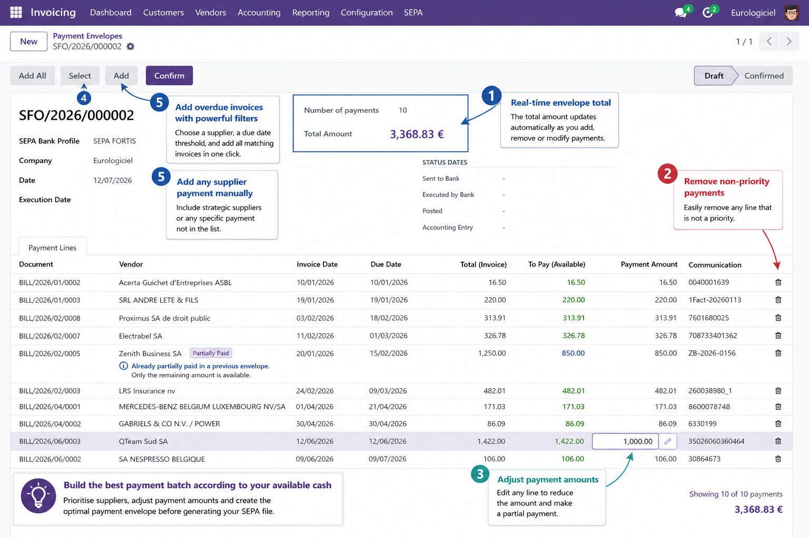
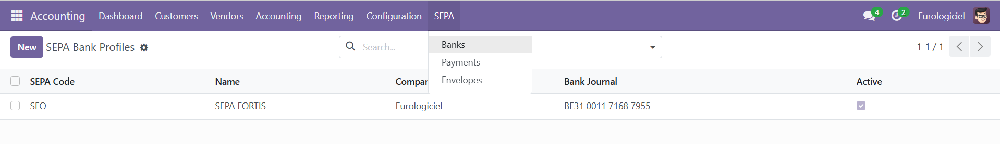
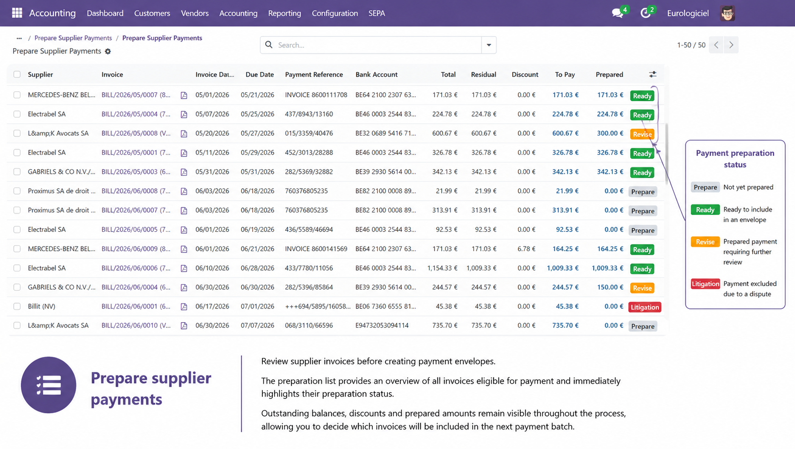
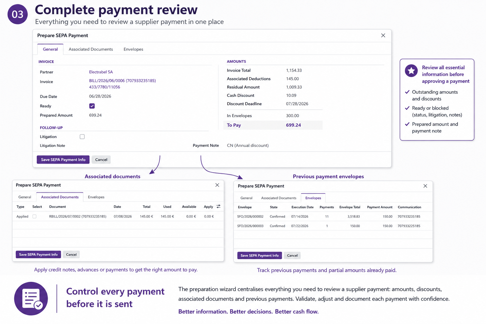
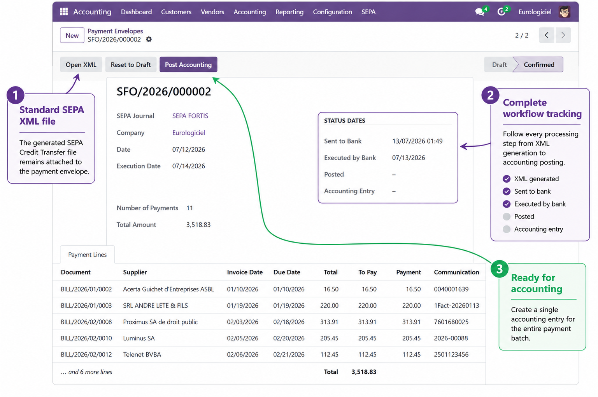
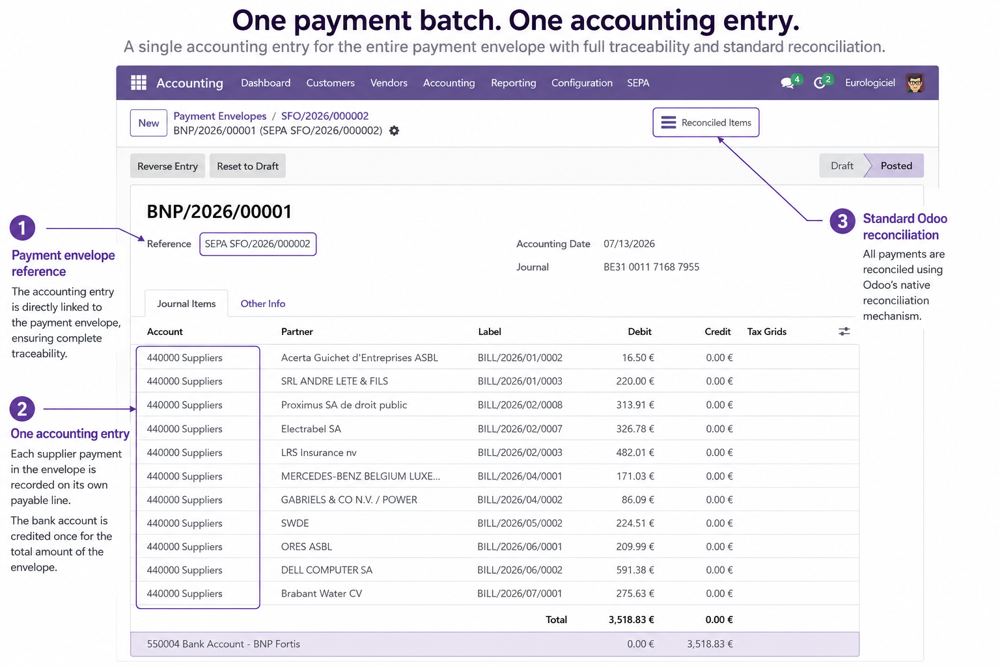

# GICA SEPA Payment

Supplier payment preparation and SEPA Credit Transfer management for Odoo.

Prepare, review and prioritise supplier payments based on your available cash before generating a standard SEPA Credit Transfer file.

Designed for organisations that want to optimise cash flow while keeping full control over supplier payments.

---

## Build the best payment batch based on your available cash

When available cash is limited, paying every due invoice automatically is not always the best option.

With GICA SEPA Payment you can:

- prioritise strategic suppliers;
- select invoices overdue before a chosen date;
- exclude disputed invoices from payment batches;
- document disputes with dedicated follow-up notes;
- remove non-priority payments;
- adjust individual payment amounts;
- handle partial payments and remaining balances;
- monitor the payment envelope total in real time;
- generate a standard SEPA Credit Transfer file when the payment batch is ready.

The payment envelope acts as a flexible working basket that can be adjusted until it matches your available cash and business priorities.

---

## Quick configuration

Configure one SEPA Bank Profile for each bank account and start preparing supplier payments immediately.

The module provides a simple three-step workflow:

1. **Bank Profiles** – configure SEPA bank profiles linked to standard Odoo bank journals.
2. **Supplier Payments** – review and prepare supplier payments.
3. **Payment Envelopes** – build, confirm, export and post payment batches.

---

## Prepare supplier payments

Review all supplier invoices eligible for payment before creating a payment envelope.

The preparation list provides an overview of outstanding invoices together with:

- outstanding balances;
- discounts;
- prepared amounts;
- preparation status.

Each invoice follows a simple workflow:

- **Prepare**
- **Ready**
- **Revise**
- **Litigation**

This helps accountants organise and prioritise supplier payments before creating the final payment batch.

---

## Complete payment review

The **Prepare SEPA Payment** wizard centralises everything required to validate a supplier payment before it is included in a payment envelope.

The wizard combines three complementary views:

- **General** – outstanding balances, discounts, litigation management, payment notes and prepared amounts.
- **Associated Documents** – automatic handling of credit notes, supplier advances and previous payments.
- **Envelopes** – complete traceability of previous payment envelopes and partial payments.

Bringing all relevant information together helps accountants make informed payment decisions while maintaining complete traceability.

---

## Complete payment workflow

Once a payment envelope has been validated, GICA SEPA Payment manages the complete payment workflow.

A standard **SEPA Credit Transfer** file (`pain.001.001.03`) is generated and attached to the payment envelope for complete traceability.

The payment envelope keeps track of every processing step:

- XML generation;
- transmission to the bank;
- bank execution;
- accounting posting.

The workflow status provides complete visibility throughout the payment lifecycle.

---

## One payment batch. One accounting entry.

Once the payment envelope has been executed by the bank, GICA SEPA Payment creates a single accounting entry for the complete payment batch.

Each supplier payment generates its own payable line while the bank account is credited only once for the total amount of the payment envelope.

The accounting entry remains fully linked to its originating payment envelope, ensuring complete traceability between supplier invoices, payment batches and accounting records.

Reconciliation relies entirely on the standard Odoo accounting mechanism.

**No parallel accounting.**

**No proprietary reconciliation process.**

---

## Mobile access

The module can be accessed through the standard Odoo web interface on mobile devices.

Mobile access is particularly useful for:

- reviewing payment envelopes;
- checking workflow status;
- validating processing steps.

Because of the amount of accounting information displayed, desktop use remains recommended for payment preparation.

---

## Requirements

### Odoo Enterprise

Install the complete **Accounting** application.

### Odoo Community

The complete Accounting interface should be available.

If necessary, the OCA module **account_usability** (or an equivalent solution) can be installed to expose the complete Accounting menus.

### Dependencies

Only the standard Odoo module:

- **account**

is required.

---

## Why GICA SEPA Payment?

- Cash-oriented supplier payment preparation
- Payment envelopes
- Partial payments
- Litigation management
- Credit notes
- Supplier advances
- Standard SEPA Credit Transfer (pain.001.001.03)
- One accounting entry per payment batch
- Standard Odoo reconciliation
- Complete workflow tracking
- Full audit trail